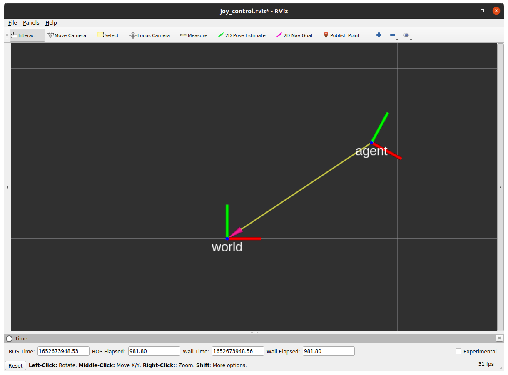
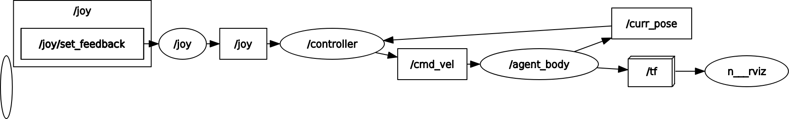

# joy_control_sample_ros

## Requirements
- Ubuntu20.04
- Python3.8
- ROS Noetic

```sh
cd ~/catkin_ws/src/joy_control_sample_ros
python3 -m pip install -r requirements.txt
rosdep install -i -y --from-paths .
```

## Usage
```sh
roslaunch joy_control_sample_ros joy_control.launch
```

### rviz


### rqt_graph


## tools
### mypy
```
./tools/run_mypy.sh
```

### black
```
./tools/run_black.sh
```
